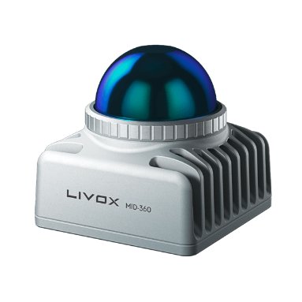
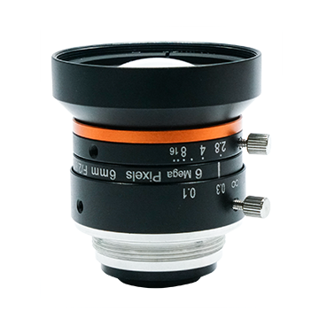
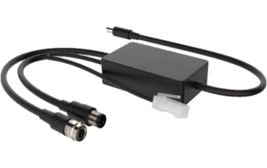
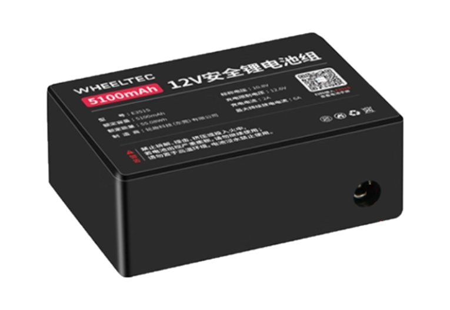
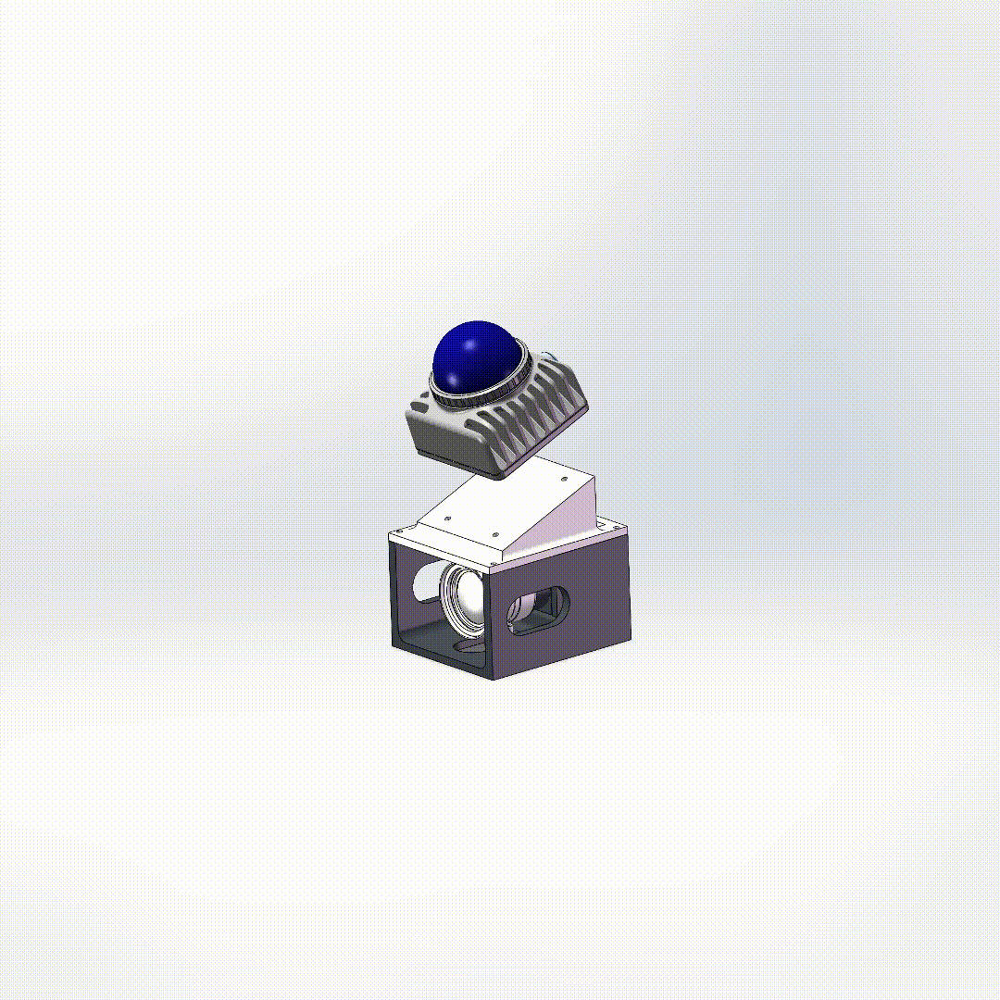
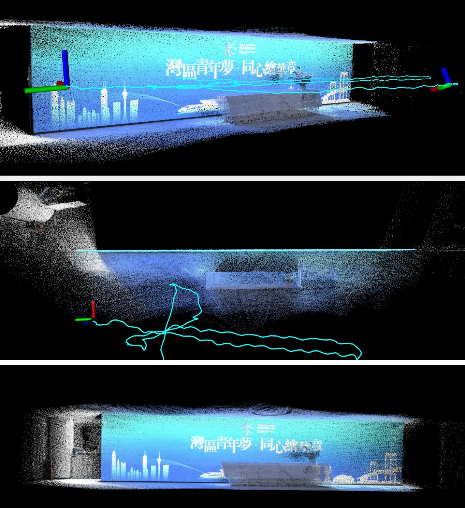
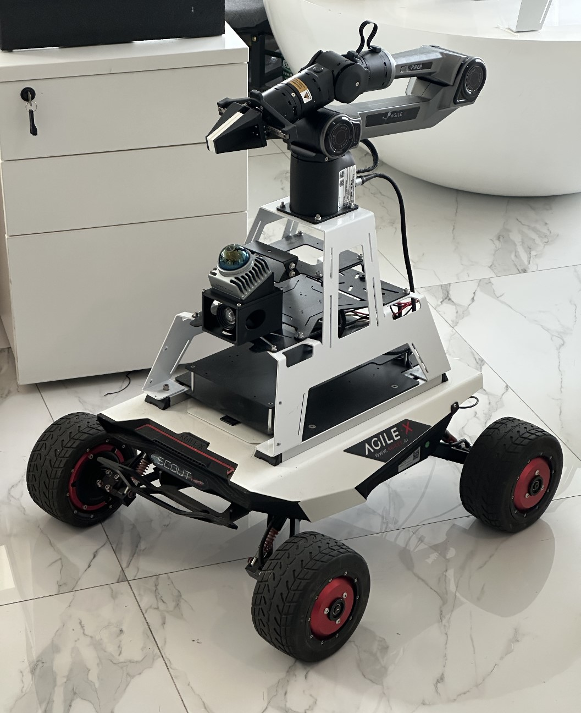

<h1>LIV-Eye: A Low-Cost LiDAR-Inertial-Visual Fusion 3D Sensor for Robotics and Embodied AI <a href="./README_zh.md">[中文]</a></h1>


<p align="center">
<a href="LICENSE"></a>
<a href="LICENSES/HARDWARE-CERN-OHL-S-2.0.txt"></a>
<a href="LICENSES/DOCS-CC-BY-4.0.txt"></a>
</p>

---

## Table of Contents
- [Highlights](#highlights)
- [Repository Structure](#repository-structure)
- [Bill of Materials (BOM)](#bill-of-materials-bom)
- [Assembly](#assembly)
- [Wiring](#wiring)
- [Driver Installation and Run](#driver-installation-and-run)
- [LiDAR-Camera Joint Calibration](#lidar-camera-joint-calibration)
- [Running FAST-LIVO2](#running-fast-livo2)
- [Platform Adaptability](#platform-adaptability)
- [Acknowledgements](#acknowledgements)
- [License](#license)

---

## Highlights
> **One sentence summary**: A ~¥5000 (≈ $700) fully open-source hardware/software LiDAR-Inertial-Visual fusion perception kit. ⚙️ Easy assembly, no soldering, one-click reproducibility. 🐳 Supports ROS1/ROS2 and Docker, 🧭 full calibration workflow (intrinsic/extrinsic/time sync), 🧰 compatible with FAST-LIVO2 algorithms, and delivers colored point cloud and odometry results in just 5 minutes.

---

## Repository Structure
```text
├── FAST-LIVO2-Mid360-Config - The configuration and launch files of FAST-LIVO2 for the Mid-360 LiDAR
├── liv_eye_cad - Solidworks files for LIV-Eye
├── livox_ros_driver2 - Livox LiDAR ROS driver
├── mvs_ros_driver - Hikvision Camera ROS driver
└── README.md - Project homepage
└── ...
```

---

## Bill of Materials (BOM)

> Target total cost: ≈ ¥5,000 (≈ $700, subject to actual purchase)

| Category | Model/Name | Reference Price | Image |
|----------|------------|-----------------|-------|
| LiDAR    | [Livox Mid-360](https://www.livoxtech.com/cn/mid-360) | Â¥3999 (≈ $560) |  |
| Camera   | [Hikvision MV-CU013-A0UC](https://www.hikrobotics.com/cn/machinevision/productdetail/?id=12628) | ¥700 (≈ $100) |  |
| Lens     | [Hikvision MVL-HF0628M-6MPE](https://www.hikrobotics.com/en/machinevision/productdetail/?id=4871) | Â¥150 (≈ $20) |  |
| Wire     | [LiDAR-Camera Hardware Synchronizer](https://item.taobao.com/item.htm?id=842691502949) | Â¥500 (≈ $70) |  |
| Battery  | [12V DC Battery](https://detail.tmall.com/item.htm?id=657166348854) | Â¥99 (≈ $15) |  |

---

## Assembly

Solidworks CAD files are provided in [liv_eye_cad](./liv_eye_cad).  
You can download and use them for 3D printing and assembly:

<p align="center">
  
  
</p>

---

## Wiring

The diagram below shows the complete wiring of **LIV-Eye**, in just six steps:

<p align="center">
  
</p>

> **Note**  
> If you do not need to use the LiDAR-Camera hardware synchronizer, please refer to the connection method and STM32 hardware synchronization solution in [LIV_handhold](https://github.com/xuankuzcr/LIV_handhold).

---

## Driver Installation and Run

1. Download and install [MVS](https://connecthkuhk-my.sharepoint.com/:u:/g/personal/zhengcr_connect_hku_hk/Ed0Xq17d6udNqYn4vkR71bQBFz0z6_Kru3cz1gD95FIgrQ?e=FPvfkT) and [Livox-SDK2](https://github.com/Livox-SDK/Livox-SDK2). Set the camera to *trigger mode* in MVS.

2. Install the camera ROS driver [mvs_ros_driver](./mvs_ros_driver) and launch in trigger mode:
```bash
roslaunch mvs_ros_driver mvs_camera_trigger.launch 
```

3. Install and launch the LiDAR ROS driver [livox_ros_driver2](./livox_ros_driver2):
```bash
roslaunch livox_ros_driver2 msg_MID360.launch
```

4. Record sensor data:
```bash
rosbag record /livox/lidar /livox/imu /left_camera/image
```

> **Note**  
> The [mvs_ros_driver](./mvs_ros_driver) and [livox_ros_driver2](./livox_ros_driver2) are the same as those in [LIV_handhold](https://github.com/xuankuzcr/LIV_handhold), and include modifications to support millisecond-level hardware synchronization.

---

## LiDAR-Camera Joint Calibration

1. Calibrate camera intrinsics. e.g. [matlab](https://ustc-flicar.github.io/calibration/index#cameras).
2. Use [FAST-Calib](https://github.com/hku-mars/FAST-Calib) for LiDAR–camera extrinsic calibration.

<p align="center">
  
  
</p>

---

## Running FAST-LIVO2

Install [FAST-LIVO2](https://github.com/hku-mars/FAST-LIVO2). The configuration and launch files for the Mid-360 are provided in [FAST-LIVO2-Mid360-Config](./FAST-LIVO2-Mid360-Config). Update the intrinsic and extrinsic parameters to match your device, then run:
```bash
roslaunch fast_livo mapping_mid360.launch
```

<p align="center">
  
</p>

---

## Platform Adaptability

**LIV-Eye is compact yet versatile!** With its small form factor, standardized wiring, and open-source software, it can be seamlessly integrated into a wide range of robotic platforms to enable perception, navigation, and embodied AI research.

<p align="center">
  
</p>


## Acknowledgements

This project is based on the following open-source projects:  

- Driver and time synchronization: [LIV_handhold](https://github.com/xuankuzcr/LIV_handhold)  
- Calibration method: [FAST-Calib](https://github.com/hku-mars/FAST-Calib)  
- Algorithm: [FAST-LIVO2](https://github.com/hku-mars/FAST-LIVO2)  

---

## License

The source code is released under the GPLv3 license.  

If you use this codebase in academic research, please cite any of the following papers:

```
[1] Zheng, Chunran, et al. "FAST-LIVO2: Fast, Direct LiDAR-Inertial-Visual Odometry." 
[2] Zheng, Chunran, et al. "FAST-LIVO: Fast and Tightly-coupled Sparse-Direct LiDAR-Inertial-Visual Odometry." 
[3] Zheng, Chunran, et al. "FAST-Calib: LiDAR-Camera Extrinsic Calibration in One Second." 
[4] Ziming, Wang, et al. "USTC FLICAR: A sensors fusion dataset of LiDAR-inertial-camera for heavy-duty autonomous aerial work robots." 
```
