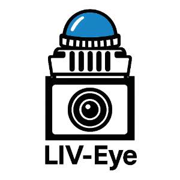
<h1>LIV-Eye: 用于机器人和具身智能的低成本激光雷达-惯性-视觉融合的3D传感器 <a href="./README.md">[English]</a></h1>

<p align="center">
<a href="LICENSE"></a>
  <a href="LICENSES/HARDWARE-CERN-OHL-S-2.0.txt"></a>
  <a href="LICENSES/DOCS-CC-BY-4.0.txt"></a>
</p>


---

## 目录
- [功能亮点](#功能亮点)
- [仓库结构](#仓库结构)
- [硬件清单（BOM）](#硬件清单bom)
- [装配](#装配)
- [接线](#接线)
- [驱动安装与运行](#驱动安装与运行)
- [激光雷达-相机联合标定](#激光雷达-相机联合标定)
- [运行FAST-LIVO2](#运行FAST-LIVO2)
- [平台适应性](#平台适应性)
- [致谢](#致谢)
- [许可证](#许可证)


---

## 功能亮点
> **一句话简介**：5000 元级别，软硬件全部开源，⚙️易组装、无焊线、可一键复现的 LiDAR–Inertial-Visual 融合感知套件。🐳支持 ROS1/ROS2、Docker，🧭全流程标定（内参/外参/时间同步），🧰 适配FAST-LIVO2系列算法，5 分钟得到可视化彩色点云与里程计结果。


---

## 仓库结构
```text
├── FAST-LIVO2-Mid360-Config - The configuration and launch files of FAST-LIVO2 for the Mid-360 LiDAR 
├── liv_eye_cad - Solidworks file of LIV-Eye
├── livox_ros_driver2 - Livox LiDAR ROS driver
├── mvs_ros_driver -  Hikision Camera ROS driver
└── README.md - Project homepage document
└── ...

```
## 硬件清单（BOM）

> 目标总成本：≈ ¥5,000（以实际采购为准）


| 类别    | 名称/型号 | 参考单价 | 图片 |
|---------|-----------|---------|------|
| LiDAR   | [Livox MID-360](https://www.livoxtech.com/cn/mid-360) | ¥3999 | 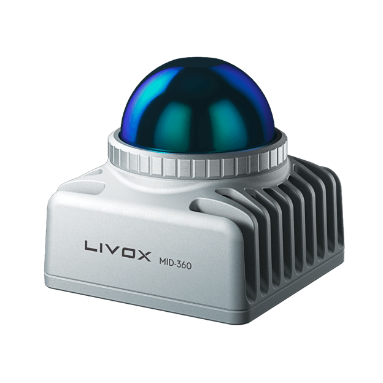 |
| Camera  | [Hikvision MV-CU013-A0UC](https://www.hikrobotics.com/cn/machinevision/productdetail/?id=12628) | ¥700 | 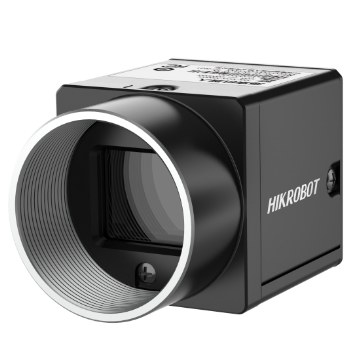 |
| Lens    | [Hikvision MVL-HF0628M-6MPE](https://www.hikrobotics.com/en/machinevision/productdetail/?id=4871) | ¥150 | 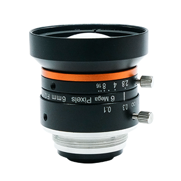 |
| Wire    | [LiDAR–Camera 硬件同步器](https://item.taobao.com/item.htm?id=842691502949) | ¥500 | 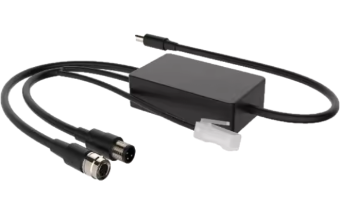 |
| Battery | [12V DC 电池](https://detail.tmall.com/item.htm?id=657166348854) | ¥99 | 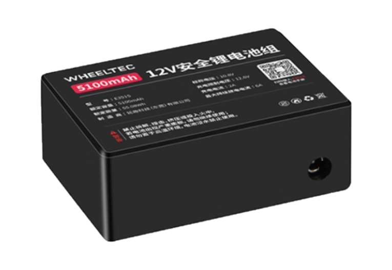 |


## 装配

Solidworks 图纸在 [liv_eye_cad](./liv_eye_cad) 中提供，用户可下载进行 3D 打印制作，装配方式如下：

<p align="center">
  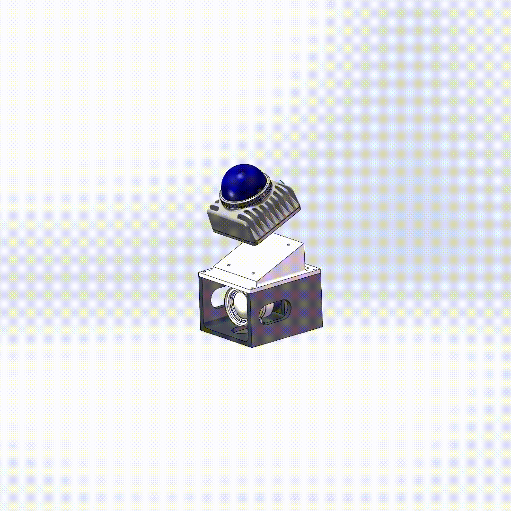
  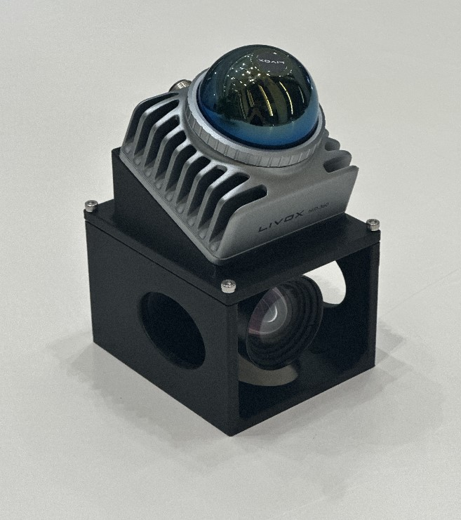
</p>

## 接线
下图展示了 **LIV-Eye** 的完整接线方式，仅需六步：

<p align="center">
  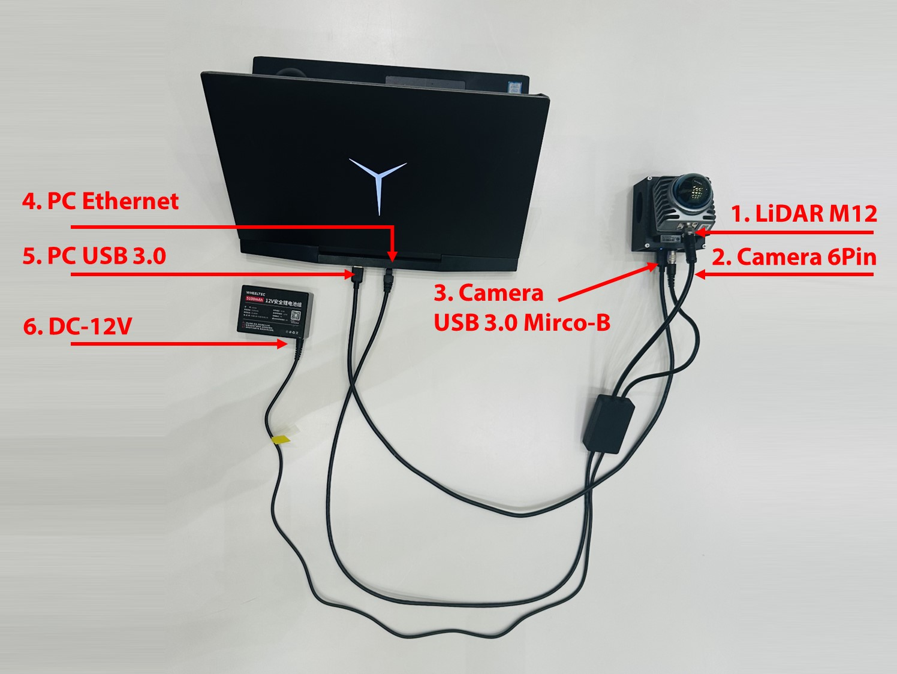
</p>


> **Note**
> 如果无需使用LiDAR-Camera 硬件同步器，请参考[LIV_handhold](https://github.com/xuankuzcr/LIV_handhold)中的连线方式与STM32硬件同步方案。

## 驱动安装与运行

1. 下载并安装 [MVS](https://connecthkuhk-my.sharepoint.com/:u:/g/personal/zhengcr_connect_hku_hk/Ed0Xq17d6udNqYn4vkR71bQBFz0z6_Kru3cz1gD95FIgrQ?e=FPvfkT) 与 [Livox-SDK2](https://github.com/Livox-SDK/Livox-SDK2)，并在MVS中设置相机为trigger模式。

2. 安装相机ROS驱动[mvs_ros_driver](./mvs_ros_driver)，以触发模式启动 MVS 相机驱动程序：
```bash
roslaunch mvs_ros_driver mvs_camera_trigger.launch 
```

3. 安装并启动激光雷达ROS驱动[livox_ros_driver2](./livox_ros_driver2)：
```bash
roslaunch livox_ros_driver2 msg_MID360.launch
```

4. 录制传感器数据：
```bash
rosbag record /livox/lidar /livox/imu /left_camera/image
```

> **Note**  
> The [mvs_ros_driver](./mvs_ros_driver) 与 [livox_ros_driver2](./livox_ros_driver2) 和 [LIV_handhold](https://github.com/xuankuzcr/LIV_handhold)中的相同，其包含了支持毫秒级硬件同步的修改。

## 激光雷达-相机联合标定

1.标定相机内参

2.使用[FAST-Calib](https://github.com/hku-mars/FAST-Calib)标定工具进行LiDAR相机外参联合标定
<p align="center">
  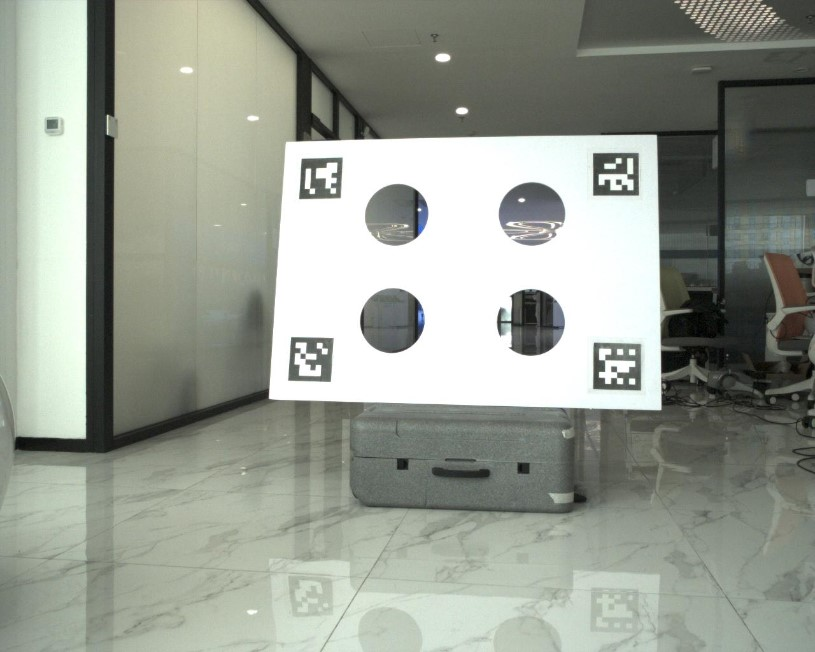
  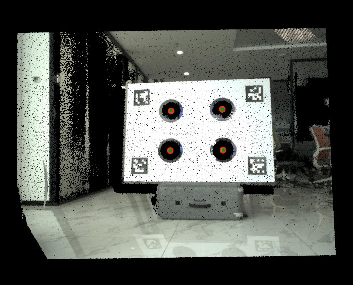
</p>


## 运行FAST-LIVO2

安装[FAST-LIVO2](https://github.com/hku-mars/FAST-LIVO2)。针对 Mid-360 的配置文件和启动文件已在 [FAST-LIVO2-Mid360-Config](./FAST-LIVO2-Mid360-Config) 中提供。修改内外参为当前设备，运行：
```bash
roslaunch fast_livo mapping_mid360.launch
```

该演示对应的示例 LIV-Eye rosbag，可以在[这里](https://pan.baidu.com/s/1bs9hSF9BD0LZFTiiEkNLeg?pwd=2zr5)下载。
<p align="center">
  
</p>

## 平台适应性

**LIV-Eye 小巧全能！**
凭借其紧凑的尺寸、标准化的布线和开源软件，它可以轻松集成到各种机器人平台中，用于感知、导航和具身智能研究。

<p align="center">
  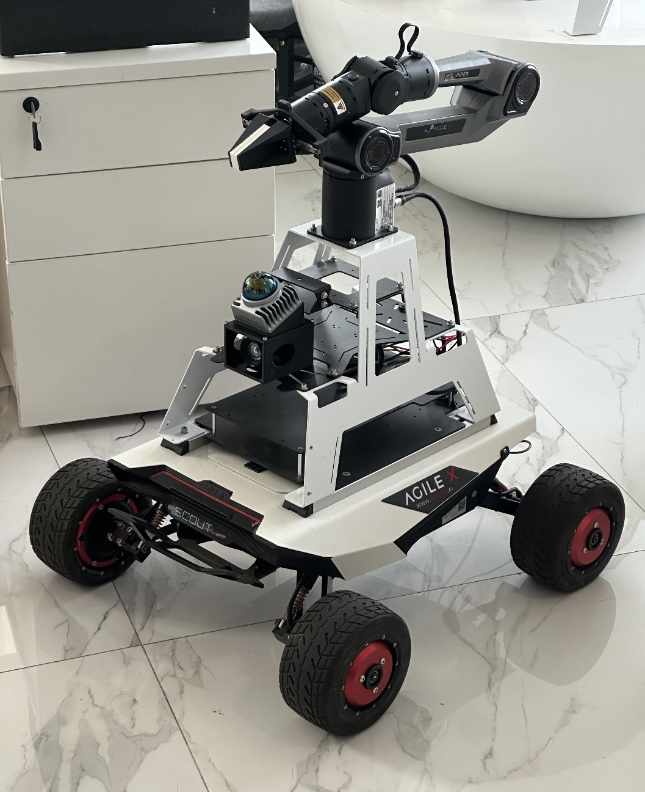
  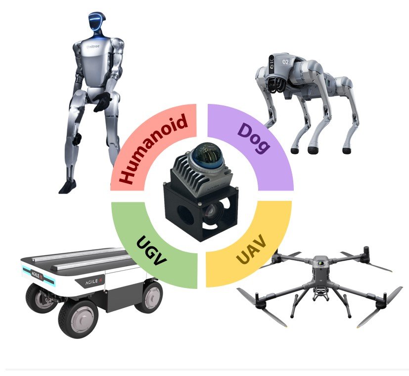
</p>


## 致谢

本项目基于以下开源项目，特此致谢：  

- 驱动与时间同步：[LIV_handhold](https://github.com/xuankuzcr/LIV_handhold)  
- 标定方法：[FAST-Calib](https://github.com/hku-mars/FAST-Calib)  
- 算法：[FAST-LIVO2](https://github.com/hku-mars/FAST-LIVO2)  
- CAD 设计: [Link](https://github.com/hku-mars/FAST-LIVO2/issues/119)@[pcl5](https://github.com/pcl5)


## 许可证
源代码采用 GPLv2 许可证发布。

如果您在学术研究中使用本代码库的任何代码，请引用我们以下任何一篇论文，我们将不胜感激：


```
[1] Zheng, Chunran, et al. "FAST-LIVO2: Fast, Direct LiDAR-Inertial-Visual Odometry." 
[2] Zheng, Chunran, et al. "FAST-LIVO: Fast and Tightly-coupled Sparse-Direct LiDAR-Inertial-Visual Odometry." 
[3] Zheng, Chunran, et al. "FAST-Calib: LiDAR-Camera Extrinsic Calibration in One Second." 
[4] Ziming, Wang, et al. "USTC FLICAR: A sensors fusion dataset of LiDAR-inertial-camera for heavy-duty autonomous aerial work robots." 
```
